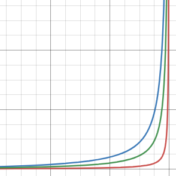

This failure mode is related to (obviously) runtimes with automatic 
memory management and garbage collection. In a nutshell, system 
with a constant incoming workload (usually, web traffic) intermittently 
generates an abnormal workload for GC, which in turn puts system in STW
pause, upon exit of which accumulated incoming workload immediately 
regenerates abnormal workload for GC, forcing system to enter a infinite 
cycle consisting mostly of STW pauses and almost no real work. However, 
at the same time, GC succeeds to free up portion of memory at every 
cycle, and OOM condition is not triggered.

This failure mode **is usually not self-recoverable** and requires 
at least taking away the input workload. Even without it, the system may 
still take some time to recover while processing current state, making
it even worse if it queues input work. For typical web applications 
where request processing doesn't make any sense single seconds after
request arrival, it is recommended just to recycle problematic instances
and replace them with healthy ones (with proper planning of evading 
situation repetition, i.e. if the failure mode is a result for 
overwhelming input workload, fleet size must be increased).

This failure mode is _usually_ triggered by improper heap sizing (not 
enough space to run gc less frequently & heap is almost filled with 
live objects prior to failure triggering).

### Detail

Most if not all runtimes with automatic memory management don't collect 
garbage at all, instead they evacuate live set from a region of memory
and then declare that region as empty and available for new allocations.
This is based on the assumption that by the moment of garbage collection
live set is smaller than amount of garbage or at least doesn't take most
of the space, which makes the job much simpler than actually accounting
for every dead allocation. Also, one of the easiest ways to divide live
and dead memory chunks is just to declare some GC roots (objects on 
stack, global variables, etc.) and then walk every reference from there,
marking each found memory reference as live and considering all memory 
references dead by default (see also CMS GC coloring). Because of that 
time of garbage collection is a function of live set size: the bigger it 
is, the more time is required to walk the whole tree and to perform the
maintenance operations (evacuation, compaction, etc.), in best case it's
linearly proportional to the size of the live set.

On the other hand, the time between GC cycles is a function of a 
allocation speed and size of live set after GC cycle. For example,
if GC is triggered upon allocation failure, i.e. 100% heap usage (which 
is not true for modern systems, which try to take preventive action and 
start parallel phase in advance), then application whose live set after
GC cycle occupies 20% of all memory space would experience GC cycles
4 times less frequent than an application with same relative fill rate
and a live set of 80% of all memory.

GC time relative to application time is a non-linear function combining 
both of the two above, roughly (`kx / 1 -x`), which belongs to a family 
of very unpleasant curves:

Once heap is occupied to some percent of always live objects, GC time to 
application time relation raises dramatically, making the runtime do
more GC work rather than application work. Since the amount of free 
space is not that big, application fills it with new allocations very 
quickly, triggering next GC loop, requiring tremendously more time for 
same work rather than under normal operation. Since the input workload
hasn't gone anywhere, application has no chance to recover: once it 
actually has generated some garbage that can be thrown away and free up 
some space, next processing takes place to occupy that space. Moreover, 
since overall application throughput is decreased, the same workload now 
requires more resources to process compared to pre failure mode state,
putting even more pressure on the system. If there would be no incoming 
workload, the system would have the chance to very slowly get back into
the safe space by chewing out what it has to process spending too much 
time on GC, but eventually arriving at a point where at least 
allocations are not done at the same rate, if not freeing up some 
additional space, but thanks to incoming workload this is not possible,
and the system is put into stable point, which consists mostly of 
garbage collection. Also, because the GC cycles are executed more 
frequently compared to application execution, less amount of allocations 
actually becomes dead between two cycles, making GC less performant, 
again, contributing to the decrement of delay between two GC cycles 
(less freed space -> less time to hit GC trigger again). The last nail 
in the coffin is that most GCs usually have a parallel phase that is 
triggered early and drags some resources from the application, limiting 
throughput even more.

### Actions

- Consider affected application instance(s) completely dead
- Spin up new application instance(s) and redirect workload to it (them)
- Recycle them, unless they have to complete the work they're doing,
then let them be until GC metrics fall down. 

### Solutions

- This is most likely happening because current heap is just a bit 
bigger than maximum live set held by application. Increasing heap will
increase time between garbage collections without incrementing the time 
of a single garbage collection.
- Increasing heap itself may not help because during the STW processing
the live set critical amount of workload may accumulate and trigger the 
same condition. The recommendation here is to switch to a GC which does
more work in parallel with application. This does not contradict stated
above (about parallel phase contributing to throughput drop): parallel
phase would not be a problem in the normal mode outside of the failure.
It would still require more resources compared to classic non-parallel 
gc because of the nature of the online mutations, but this allows to
work with pause times more carefully, and a long STW pause is usually
the trigger for the cascade failure.
